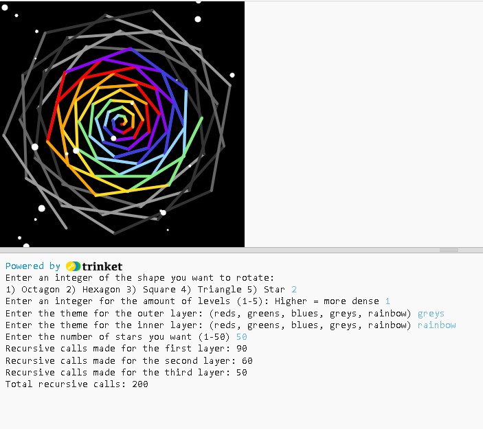

# Rotating Shapes Program- Evan Chan

## Project Overview
- My program is a rotating shapes program that takes user input to create a program that takes a shape, and increases its size while rotating it and draw stars around, to create beautiful and abstract patterns. 
- It passes through the function twice: once for the outer layer and again but with less turns for the inner layer. 
- The user decides the shape, the number of levels/density, the themes of both layers, and the number of stars

## Recursive Approach
### First Function
- Each recursive call draws one iteration of the pattern (or one full shape)
- After each shape, the turtle turns slightly and makes another recursive call
- The "turn" parameter decreases by 1 each time the function calls itself to eventually lead to the base case: turns == 0, and exit out of the function
- Because each turn moves the turtle by a specific small angle (calculated by dividing the number of degrees in a circle by the number of turns), the function will always stop when the shapes have reached a full 360 degree rotation from its starting position
### Second Function
- The base case is when n == 0. This is when there are no more stars to draw so the function returns 0
- Each recursive call draws one star, moves the turtle to a random position, and then calls itself again with one fewer star remaining (n-1)

## How to run the program
- This program requires a compiler that supports turtle graphics
- Once running, the user should follow the prompts given:
    1. Enter an integer of the shape you want to rotate:1) Octagon 2) Hexagon 3) Square 4) Triangle 5) Star
    2. Enter an integer for the amount of levels (1-5): Higher = more dense
    3. Enter the theme for the outer layer: (reds, greens, blues, greys, rainbow)
    4. Enter the theme for the inner layer: (reds, greens, blues, greys, rainbow)
    6. Enter the number of stars you want (1-50)
- If an input that was not specified was inputted, the program will keep asking until a valid input was inputted
    - e.g. If "6" is inputted for the first prompt, the program will ask you to answer the question again: Invalid option. Please type an integer from 1-5

## More about the program
### Inputs on Outputs
- For the first prompt, it asks the user for an integer from 1-5. Each number corresponds to a "shape". This shape is actually just created by changing the angle in which the turtle rotates after every line. So if the user inputs 3 (which corresponds to the square), the turtle would rotate to the left 90 degrees, creating the square shape the user sees
- For the second prompt, it asks the user for an integer from 1-5. These values correspond to a different level/density of the drawing. The parameter "levels" is used in the main for loop for the amount of times that the turtle would draw a shape, thus creating a denser look for larger values passed
- For the third and fourth inputs, it asks the user for the colour themes of the outer and inner layer. The value that the user inputs corresponds to a key in the dictionary created at the top. That key holds a list of colour values that would later be used when drawing the shapes.
- For the last input, it asks the user for the amount of stars they want. The number they input is the amount of randomly placed stars that would be drawn on the screen

## Screenshots
### The first two screenshots below show the difference between a level 1 triangle and a level 5 triangle
- Input = 4, 1, reds, blues, 1 
- 

- Input = 4, 5, blues, reds, 1
- 

### The next two screenshots show the difference between 50 stars and 25 stars (in addition to the different colours, levels, and shapes)
- Input = 2, 1, greys, rainbow, 50
- 

- Input = 5, 4, greens, blues, 25
- 

## Test cases
- Input = 2, 1, reds, rainbow, 1
- Expected output = a red hexagon rotating and growing larger every single rotation, then a rainbow hexagon doing the same but on top of it and ending sooner. 1 star placed. Also returns the total number of recursive calls
- Actual output = a red hexagon rotating and growing larger every single rotation, then a rainbow hexagon doing the same but on top of it and ending sooner. 1 star placed. Also returns the total number of recursive calls of 150+ns
- Expected and Actual output is the exact same

- Input = 5, 5, blues, greens, 50
- Expected output = blue star rotating and growing larger every rotation, very dense/rotates alot more times. Same for greens, but ends sooner. 50 stars placed. Also returns the total number of recursive calls
- Actual output = blue star rotating and growing larger every rotation, very dense/rotates alot more times. Same for greens, but ends sooner. 50 stars placed. Also returns the total number of recursive calls of 150+n
- Exected and Actual output is the exact same

## Reasonable Recursion Depth
### First Function
- The depth of the recursion is controlled by the variable "turns"
- This means each call of the function will result in one more rotation of the shape
- If "turns" is too low(turns<20): The pattern will look incomplete and the recursion will end very quickly, only getting through a few shapes
- If "turns" is too high(turns>250): The performance will decrease significantly and possibly lag. It could also freeze because of the large amount of recursive calls being made 
- A reasonable range for turns is around 60-150, as demonstrated by my use of 90 in the program. This range ensures that the pattern will actually complete a full rotation without any performance/lag issues
### Second Function
- The depth of this recursion is controlled by n, which is the user inputted value numStars
- n represents the number of stars that would be randomly drawn on the screen
- an n value too high(>100) would result in long periods of delay drawing it, and performance/lag issues
- an n value too low (<1) wouldnt work because the number of stars drawn cannot be negative
- a reasonable range for the function would be around 1-50, which is the range that the user is forced to input in

## Testing Debugging and Validation
1. Verified that the recursion actually terminated when turns == 0
2. Implemented while loops to ensure all user inputs were valid
3. Colour index was going out of range and erroring originally, so an if statement was used to reset the index back to 0 every time it reached the end of the colour list
4. Ran multiple tests to make sure that the different combinations of shapes and levels worked to rotate around a full circle
5. Added return values to count and confirm the amount of recursive calls made

## Challenges
- One challenge that I faced when coding this program was making the line change colours every single iteration without the colour index going out of range. I originally tried solving this issue with some very complex modulus operation that didnt end up working in the end. After testing for a little bit, I created a simpler, yet effective method for it: If the colour index is equal to the length of the colours list, then reset the colour index back to 0. This ensured that the colour index never went past the boundary point and continued to iterate through the colours.
 
## Peer Review
### Suggestions:
- Add error handling code, if the user inputs something that isnt supported
- Add more colours
### Changes made:
- Created while loops to repeatedly ask the user the question if unsupported value was passed
- Added a wider range of colour choices to choose from (greys and rainbow)

